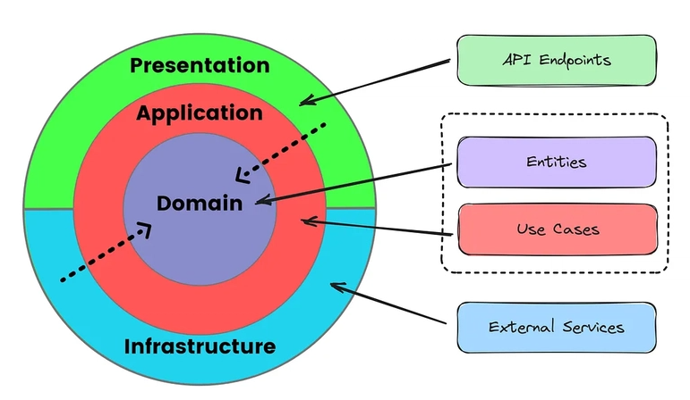

# Clean Architecture Template
O *Template* Básico proposto visa simplificar a demonstração do fluxo de dados entre as camadas da Clean Architecture, dispensando a utilização de Design Patterns avançados como Mediator ou bibliotecas de mapeamento, como o AutoMapper.

Em alinhamento com esta premissa de simplicidade, a solução omite a criação de DTOs de entrada dedicados à Camada de Apresentação, como `CriarProdutoRequest`. Em vez disso, o Objeto `Command` (definido na Camada de Aplicação) é utilizado diretamente como modelo de entrada (payload) nos *endpoints* da API. Essa abordagem é justificada pela paridade estrutural dos modelos de dados. Como o `Command` já encapsula exatamente os dados necessários para a execução do Caso de Uso - Regra de Negócio da Aplicação - e o cenário proposto não exige transformações de dados ou regras de negócio que demandem um mapeamento explícito na fronteira da Camada de Apresentação, evitamos a duplicação desnecessária de classes e simplificamos o fluxo.

> Nota: Em cenários onde a arquitetura exige a transição explícita entre modelos de dados - mapear um `Request` da API para um `Command` da Aplicação, ou uma `Entidade` para um Response - a prática de mapeamento é crucial. Para gerenciar essa transição, o projeto pode adotar:
> 1. Bibliotecas de mapeamento por convenção, como AutoMapper ou Mapster.
> 2. O uso de Métodos de Extensão (`.ToCommand()`, `.ToResponse()`, ou `.ToEntidade`) ou *mappers* dedicados, que oferecem maior rastreabilidade e menos dependências externas.
> 
> Particularmente, priorizo os Métodos de Extensão por promoverem um fluxo de dados mais transparente e desacoplado de bibliotecas de terceiros.

## Camadas da Solução ou Anéis da Arquitetura
A Clean Architecture estabelece uma rigorosa separação de responsabilidades organizada em quatro camadas concêntricas (Domínio, Aplicação, Apresentação e Infraestrutura). Duas dessas camadas — Domínio (Entidades) e Aplicação (Casos de Uso) — são designadas para proteger o Domínio de Negócio (Core), sendo totalmente independentes de tecnologia.
A organização da arquitetura se dá em anéis concêntricos, regidos pela Regra de Dependência: as dependências entre as camadas devem sempre apontar para dentro (do exterior para o interior). Isso significa que uma camada mais externa (ou anel mais externo) só pode referenciar (ou depender) de camadas que lhe são mais internas, garantindo que o núcleo do negócio seja isolado e protegido de detalhes de implementação externos.

- Arquitetura em Anéis



- Estrutura de Pastas da Solução
```
📁 App
├── 📁 Api
│   ├── 📁 Endpoints
│   │   └── 📄 ProdutoEndpoints.cs
│   ├── 📁 Properties
│   │   └── ⚙️ launchSettings.json
│   ├── 📄 Api.csproj
│   ├── 📄 Api.http
│   ├── 📄 Program.cs
│   ├── ⚙️ appsettings.Development.json
│   └── ⚙️ appsettings.json
├── 📁 Application
│   ├── 📁 Interfaces
│   │   └── 📄 IProdutoRepository.cs
│   ├── 📁 UseCases
│   │   └── 📁 Produtos
│   │       └── 📁 CriarProduto
│   │           ├── 📄 CriarProdutoCommand.cs
│   │           └── 📄 CriarProdutoUseCase.cs
│   └── 📄 Application.csproj
├── 📁 Domain
│   ├── 📁 Entities
│   │   └── 📄 Produto.cs
│   └── 📄 Domain.csproj
└── 📁 Infrastructure
    ├── 📁 Data
    │   ├── 📁 Repositories
    │   │   └── 📄 ProdutoRepository.cs
    │   └── 📄 AppDbContext.cs
    ├── 📁 Migrations
    │   ├── 📄 20251120220824_VersaoInicial.Designer.cs
    │   ├── 📄 20251120220824_VersaoInicial.cs
    │   └── 📄 AppDbContextModelSnapshot.cs
    └── 📄 Infrastructure.csproj
```

### - **Domínio** (*Domain*)
Detém as Regras de Negócio Empresariais mais fundamentais e duradouras. Essa camada (ou anel) defini as `Entidades` e as regras de estado e de comportamento delas, com esta responsabilidade torna-se o núcleo da solução e é independente de qualquer tecnologia externa.

### - **Aplicação** (*Application*)
Contém as Regras de Negócio da Aplicação e orquestra o fluxo de dados. Defini e implementa os `Casos de Uso (Use Cases)`, eles coordenam as `Entidades` e definem as `Interfaces (Contratos)` necessárias para a persistência e comunicação com o banco de dados (ou outro meio exterior).

### - **Apresentação** (*Presentation*)
Responsável por adaptar e apresentar os dados das estruturas internas para as externas (e vice-versa). Inclui `Controladores (APIs)`, `Apresentadores (Presenters)` e a definição de modelos específicos para a entrada/saída de dados.

### - **Infraestrutura** (*Infrastructure*)
Possui os detalhes de tecnologia e ferramentas externas. Implementa os detalhes concretos da aplicação, isso inclui a implementação dos `Repositórios (EF Core/SQL)`, servidores web e qualquer outro serviço externo.

#### Migrations
1. Adicionar versão
```powershell
dotnet ef migrations add VersaoInicial --startup-project .\src\Api\ --project .\src\Infrastructure\
```
2. Aplicar versão na base da dados
```powershell
dotnet ef database update --startup-project .\src\Api\ --project .\src\Infrastructure\
```
